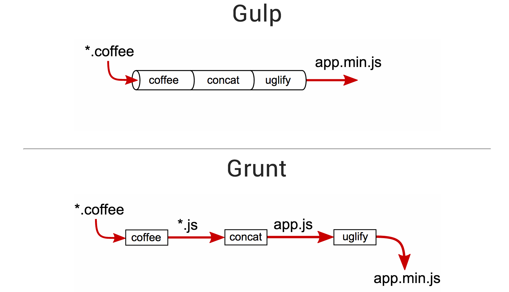

# gulp

+ [gulp](http://gulpjs.com/)
+ [gulp github](https://github.com/gulpjs/gulp/blob/master/README.md)

> **바로가기**
> + [1. gulp의 특징](#1-gulp의-특징)
> + [2. Getting Start](#2-getting-start)
> + [3. gulp API](#3-gulp-api)
> + [4. .pipe()](#4-pipe)

## 1. gulp의 특징

+ 자동화 : 개발 워크 플로우에서 고통스럽거나 시간 소모적인 작업을 자동화하기 위한 툴킷이다.
+ platform-agnostic : 모든 주요 IDE에 통합되어 있으며 사람들은 PHP, .NET, Node.js, Java 및 기타 플랫폼에서 gulp를 사용한다.
+ 강력한 생태계 : npm모듈을 사용해 원하는 모든 작업을 수행 2000개 이상의 스트리밍 파일 변환을 위한 큐레이팅 된 플러그인을 보유한다.
+ simple : minimal API surface만을 제공함으로써 gulp는 쉽게 배우고 사용할 수 있다.

> **platform-agnostic**  
플랫폼에 구애받지 않는, 크로스 플랫폼  
[agnostic](http://whatis.techtarget.com/definition/agnostic)

Gulp 는 steaming build system 을 표방한다.
즉, **Node의 스트림 기능** 으로 인해 이득을 얻는 빌드 시스템이란 의미다.

> stream은 메모리 버퍼와 대역폭을 절약할 수 있는 이벤트 기반의 I/O 인터페이스를 제공한다.  
예를 들어, 스트림은 대용량 파일 같은 경우, 파일 전체를 모두 로드하기 전에 메모리 버퍼를 절약하기 위해 무엇인가 다른 일을 빠르게 처리할 수 있다.  
우리는 파일이 전체로 로드될 때까지 기다릴 필요없이 파일 일부를 쓰거나 어떤 처리를 할 수 있다.

### gulp로 할 수 있는 일
+ 웹 서버 동작
+ Sass 컴파일
+ 편집기 툴에서 파일을 저장할때마다 웹브라우를 reload하여 새로고침없이 브라우저를 갱신 (browserSync)
+ 배포를 위한 리소스 최적화 (minify)


### Sample `gulpfile.js`

```javascript
var gulp = require('gulp');
var coffee = require('gulp-coffee');
var concat = require('gulp-concat');
var uglify = require('gulp-uglify');
var imagemin = require('gulp-imagemin');
var sourcemaps = require('gulp-sourcemaps');
var del = require('del');

var paths = {
  scripts: ['client/js/**/*.coffee', '!client/external/**/*.coffee'],
  images: 'client/img/**/*'
};

// 모든 작업에 스트림을 사용해야하는 것은 아니다.
// gulpfile은 또 다른 node 프로그램이며 npm에서 사용가능한 패키지를 사용할 수 있다.
gulp.task('clean', function() {
  // 'gulp.src' 와 같이 여러 globbing 패턴을 사용할 수 있다.
  return del(['build']);
});

gulp.task('scripts', ['clean'], function() {
  // 소스 맵을 맨 아래로 두어 모든 자바스크립트를 축소하고 복사한다.(vendor scripts를 제외하고)
  return gulp.src(paths.scripts)
    .pipe(sourcemaps.init())
      .pipe(coffee())
      .pipe(uglify())
      .pipe(concat('all.min.js'))
    .pipe(sourcemaps.write())
    .pipe(gulp.dest('build/js'));
});

// 모든 정적 이미지 복사하여
gulp.task('images', ['clean'], function() {
  return gulp.src(paths.images)
    // 옵션을 task에 전달한다.
    .pipe(imagemin({optimizationLevel: 5}))
    .pipe(gulp.dest('build/img'));
});

// 파일이 변경되면 작업을 다시 실행한다.
gulp.task('watch', function() {
  gulp.watch(paths.scripts, ['scripts']);
  gulp.watch(paths.images, ['images']);
});

// default task는 cli에서 'gulp'를 실행할 때 호출된다.
gulp.task('default', ['watch', 'scripts', 'images']);
```

## 2. Getting Start

※ 이전에 전역적으로 gulp를 설치한 경우 `npm rm --global gulp`를 먼저 실행하라.

gulp는 node.js의 스트림 기능을 기반으로 하고 있기 때문에 node.js와 npm 설치가 선행되어야 한다. 
```
node --version
npm --version
```

**`gulp`** command를 전역적으로 설치한다.
```
npm install --global gulp-cli
```

**`package.json`** 을 생성해서 **`gulp`** 를 devDependencies에 설치한다.
```
npm install --save-dev gulp
```

프로젝트 디렉토리에 **`gulpfile.js`** 를 생성한뒤 다음 내용을 작성한다. 
```javascript
var gulp = require('gulp');

gulp.task('default', function(){
  // 기본 task 코드를 작성한다.
});
```

프로젝트 디렉토리에서 작성한 **`gulp`** 명령어를 실행한다.
```
gulp
```

※ gulp의 default task는 아무것도 실행하지 않는다.
```
[16:40:48] Using gulpfile ~\Desktop\project\gulpfile.js
[16:40:48] Starting 'default'...
[16:40:48] Finished 'default' after 59 μs
```

## 3. gulp API

> **바로가기**
> + __[gulp.src(globs[, options]) ](#31-gulpsrcglobs-options)__ | 어떤 파일을 읽을지 정한다.
> + __[gulp.dest(path[, options])](#32-gulpdestpath-options)__ | 어디에 저장할 지 정한다.
> + __[gulp.task(name [, deps, fn])](#33-gulptaskname-deps-fn)__ | gulp가 처리할 작업(task)을 정의한다.
> + __[gulp.watch(glob[, opts], tasks/cb)](#34-gulpwatchglob-opts-tasks-or-gulpwatchglob-opts-cb)__ | 전달된 glob에 해당하는 파일을 주시하다가 변동이 있을때 task들을 실행한다.

### 3.1. gulp.src(globs[, options])

해당 task(수행할 일)의 대상이 되는 파일들을 지정해주는 역할을 한다.   

지정한 `glob`또는 `glob 배열`을 통해 일치하는 파일을 내보낸다.  
플러그인에 파이프 될 수 있는 [`Vinyl files`](https://github.com/gulpjs/vinyl-fs)의 stream을 반환한다.

> **Vinyl**  
파일을 설명하는 매우 단순한 메타 데이터 객체이다.  
파일을 경로와 컨텐츠 등의 메타데이터로 추상화해서 그 파일이 Gihub이든 s3이든 로컬 파일 시스템이든 관계없이 다룰 수 있도록 한다.  
>
> gulp는 stream 기반이기는 하지만 또한 Vinyl라는 일종의 가상파일 포맷에도 기반하고 있다.  
gulp에서 task를 작성할 때 파일을 가져오는 방식으로 gulp.src를 사용하는데, 
이 부분이 파일 시스템에서 파일을 읽어서 vinyl object로 변환해주는 과정이다.
>
> [참고 : gulp와 Browserify 그리고 vinyl](http://programmingsummaries.tistory.com/382)

```javascript
gulp.src('client/templates/*.jade')
  .pipe(jade())
  .pipe(minify())
  .pipe(gulp.dest('build/minified_templates'));
```

#### globs

+ Type: `String` or `Array`

파일을 선택하는 방식은 [node-glob](https://github.com/isaacs/node-glob/)의 문법을 따른다.  
와일드 카드 형태로(`/**/*`) 표현할 수도 있고 배열을 사용해 여러개의 파일과 폴더를 가져올 수도 있다.  
`glob`앞에 '!'표시 되어 있는 것은 이 파일은 포함하지 말라는 의미이다.

```javascript
gulp.src('project/src/js/**/*.js');

gulp.src([
  'project/src/js/navigation.js',  
  'project/src/js/slider/*.js',
  '!project/src/js/slider/slider-beta.js'  
]);
```  

> **wild card**  
파일을 지정할 때, 구체적인 이름 대신에 여러 파일을 동시에 지정할 목적으로 사용하는 특수 기호. `＊', `？' 따위.

> **※ globs 문법이란?**  
```javascript
// 1개 이상 설정할 경우 배열(Array) 문법을 사용한다.
gulp.src(['*.js', '!b*.js', 'bad.js']);
```

#### options

+ Type: `Object`

glob-stream을 통해 [node-glob](https://github.com/isaacs/node-glob)에 전달할 옵션이다.  
gulp는 `ignore`를 제외하고 [node-glob이 지원하는 모든 옵션](https://github.com/isaacs/node-glob#options)과 [glob-stream](https://github.com/gulpjs/glob-stream)을 지원하며 다음 옵션을 추가한다.

##### options.buffer

+ Type: `Boolean` 
+ Default: `true`

이 값을 `false`로 설정하면 `file.contents`를 buffer file 대신 stream으로 반환한다.   
대용량 파일로 작업할 때 유용하다.  
**참고** : 플러그인은 stream에 대한 지원을 구현하지 않을 수 있다.

##### options.read

+ Type: `Boolean` 
+ Default: `true`

이 값을 `false`로 설정하면 `file.contents`가 `null`로 반환되고 파일을 모두 읽지 않는다.

##### options.base

+ Type: `String` 
+ Default: glob가 시작되는 위치 (참고 : [glob2base](https://github.com/contra/glob2base))

E.g., somefile.js가 client/js/somedir안에 있을 때 :
```javascript
gulp.src('client/js/**/*.js') // 'client/js/somedir/somefile.js'를 불러오고 'base'를 'client/js/'로 해석한다.
    .pipe(minify())
    .pipe(gulp.dest('build')); // 'build/somedir/somefile.js' 파일을 작성한다.

gulp.src('client/js/**/*.js', {base: 'client'})
    .pipe(minify())
    .pipe(gulp.dest('build')); // 'build/js/somedir/somefile.js' 파일을 작성한다.
```

### 3.2. gulp.dest(path[, options])

해당 task의 결과물이 저장될 경로를 지정한다.

파이프된 stream을 파일로 변환한다. 이 작업이 수행 된 후에도 계속해서 stream을 반환하므로 여러 폴더에 대해 작업을 할 수 있다.   
지정된 폴더가 없으면 새로 생성한다.

```javascript
gulp.src('./client/templates/*.jade')
    .pipe(jade())
    .pipe(gulp.dest('./build/templates'))
    .pipe(minify())
    .pipe(gulp.dest('./build/minified_templates'));
```

파일의 저장 경로는 지정한 대상 디렉토리(destination directory)에 파일 상대 경로를 추가하여 연산된다.  
차례로 상대 경로가 파일 base를 기반으로 연산된다. (자세한 정보는 위 `gulp.src` 참고)

#### path

+ type: `String` or `Function`

파일 저장 경로(출력 폴더)이다. 또는 이를 반환하는 함수면 함수에서는 [vinyl File instance](https://github.com/gulpjs/vinyl)를 제공한다. 

#### options

+ type: `Object`

##### options.cwd

+ type: `String`
+ Default: `process.cwd()`

결과물을 출력할 `cwd` 폴더를 지정한다. 출력 폴더가 상대 경로일 경우에만 작동한다.

##### options.mode

+ type: `String`
+ Default: `0777`

출력 폴더를 생성하기 위해 필요한 폴더의 모드를 8진수 사용 권한 문자열로 설정한다.

### 3.3. gulp.task(name [, deps] [, fn])

새로운 gulp task를 등록해주는 역할을 한다.  
가장 기본적인 형태에서는 첫번째 parameter에 task 이름, 두번째 parameter에 실제 작업할 내용의 함수가 위치하게 된다.

[Orchestrator](https://github.com/robrich/orchestrator)를 사용하여 작업을 정의한다.

```javascript
gulp.task('somename', function(){
  // Do stuff
});
```

> **Orchestrator**  
최대 동시성으로 작업 및 종속성을 시퀀싱하고 실행하기위한 모듈
```javascript
// gulp/index.js에서 일부 발췌
function Gulp() {
  Orchestrator.call(this);
}
util.inherits(Gulp, Orchestrator);

Gulp.prototype.task = Gulp.prototype.add;
```

#### name

+ type: `String`

task 이름. 명령 행에서 실행할 task에는 공백이 없어야한다.

```javascript
gulp.task('sass', function() {
  return gulp.src('project/**/*.scss')
             .pipe(sass().on('error', sass.logError))
             .pipe(gulp.dest('project/dist/css'))
});
```
```
$ gulp sass
[15:05:20] Using gulpfile ~\Desktop\project\gulpfile.js
[15:05:20] Starting 'sass'...
[15:05:20] Finished 'sass' after 10 ms
```

#### deps

+ type: `Array`

현재 task가 실행되기 전에 실행되고 완료되어햐 하는 task 배열

```javascript
gulp.task('mytask', ['array', 'of', 'task', 'names'], function() {
  // Do stuff
});
```
**참고** : 만약 종속성 작업이 끝나기도 전에 실행된다면 비동기 실행 힌트(async run hints)를 통해 종속성 작업이 올바르게 작동하는지 확인하라.  
async run hints: 콜백을 사용하거나 `promise` 또는 `event stream을` 반환한다. (아래 비동기 작업 지원 참고)

의존성 task 번들만 실행하려는 경우 함수를 생략할 수도 있다.
```javascript
gulp.task('build', ['array', 'of', 'task', 'names']);
```
**참고** : task는 병렬로(한꺼번에) 실행되므로 작업이 순서대로 시작/완료된다고 생각하지 말 것

#### fn

+ type: `Function`

함수는 task의 주요 작업을 수행한다. 일반적으로 다음과 같은 형식을 취한다.
```javascript
gulp.task('buildStuff', function() {
  // Do something that "builds stuff"
  var stream = gulp.src(/*some source path*/)
  .pipe(somePlugin())
  .pipe(someOtherPlugin())
  .pipe(gulp.dest(/*some destination*/));

  return stream;
  });
```
#### Async task support (비동기 작업 지원)

`fn`이 다음 중 하나를 수행하면 작업을 비동기 적으로 만들 수 있다.

##### Accept a callback (콜백 사용)
```javascript
var exec = require('child_process').exec;
gulp.task('jekyll', function(cb) {
  // build Jekyll
  exec('jekyll build', function(err) {
    if (err) return cb(err); // return error
    cb(); // finished task
  });
});

// use an async result in a pipe
gulp.task('somename', function(cb) {
  getFilesAsync(function(err, res) {
    if (err) return cb(err);
    var stream = gulp.src(res)
      .pipe(minify())
      .pipe(gulp.dest('build'))
      .on('end', cb);
  });
});
```

> **require()**  
어플리케이션에 필요한 모듈을 불러올때 `require()` 을 사용한다.  
>
> [Node.js > modules > The module scope : require()](https://nodejs.org/api/modules.html#modules_require) 

##### Return a stream (stream 반환)

```javascript
gulp.task('somename', function() {
  var stream = gulp.src('client/**/*.js')
    .pipe(minify())
    .pipe(gulp.dest('build'));
  return stream;
});
```
##### Return a promise (promise 반환)

```javascript
var Q = require('q');

gulp.task('somename', function() {
  var deferred = Q.defer();

  // do async stuff
  setTimeout(function() {
    deferred.resolve();
  }, 1);

  return deferred.promise;
});
```
**참고** : 기본적으로 작업들은 최대 동시성으로 실행된다.  
모든 작업이 한 번에 실행되면 작업들은 대기없이 모조리 한번에 실행된다.  
**특정 순서로 작업이 실행되도록** 하려면 다음 두 가지를 만족해야한다.  
+ 작업이 언제 완료되는 지 표시하고
+ 다른 작업에서 해당 작업의 완료에 대해 표시해야한다.

예제로, 먼저 'one', 'two'라는 두 가지 작업이 있다고 가정할 때
1. 'one'에서 작업이 완료되면 알려주는 hint를 추가한다.  
(콜백을 사용하거나 promise나 stream을 반환해서)
1. 작업 'two'에서 실행 이전에 필요한 'one'이라는 작업을 종속성 작업으로 지정한다.  
(첫번째 작업 완료에 의존한다는 hint를 추가한다.)

예시 코드 : 
```javascript
var gulp = require('gulp');

// takes in a callback so the engine knows when it'll be done
gulp.task('one', function(cb) {
  // do stuff -- async or otherwise
  cb(err); // if err is not null and not undefined, the run will stop, and note that if failed
})

// identifies a dependent task must be complete before this one begins
gulp.task('two', ['one'], function(){
  // task 'one' is done now
});

gulp.task('default', ['one', 'two']);
```

> **참고글**  
> + [비동기적 JavaScript](https://hyunseob.github.io/2015/08/09/async-javascript/)
> + [JavaScript Promise](https://hyunseob.github.io/2016/03/14/javascript-promise/)
> + [비동기 프로그래밍을 위한 Promise와 Deferred 알아보기](http://webframeworks.kr/tutorials/angularjs/angularjs_promise_deferred/)
> + [MDN : Deferred](https://developer.mozilla.org/en-US/docs/Mozilla/JavaScript_code_modules/Promise.jsm/Deferred)
> + [Node.js: 비동기 프로그래밍 이해](http://www.nextree.co.kr/p7292/)

### 3.4. gulp.watch(glob [, opts], tasks) or gulp.watch(glob [, opts, cb])

파일에 변경이 있을 때마다 변경을 감지해서 task를 실행할 수 있는 기능이다.  
언제나 `change` 이벤트를 발생시키는 `EventEmitter`를 반환한다.  

### gulp.watch(glob[, opts], tasks)

#### glob

+ Type: `String` or `Array`

변경 사항을 감시할 타켓 파일이다. 단일 glob 또는 배열을 지정할 수 있다.

#### opts

+ Type: `Object`

[`gaze`](https://github.com/shama/gaze)로 넘겨지는 옵션이다.

#### tasks

+ Type: `Array`

파일이 변경될때마다 gulp.task()로 추가되어 호출 할 task 이름

```javascript
var watcher = gulp.watch('js/**/*/js', ['uglify', 'reload']);
watcher.on('change', function(event) {
  console.log('File ' + event.path + 'was' + event.type + ', running tasks...');
});
```

### gulp.watch(glob[, opts, cb])

#### glob

+ Type: `String` or `Array`

변경 사항을 감시할 타켓 파일이다. 단일 glob 또는 배열을 지정할 수 있다.

#### opts

+ Type: `Object`

[`gaze`](https://github.com/shama/gaze)로 넘겨지는 옵션이다.

#### cb(event)

+ Type: `Function`

각 변경에 대해 호출되는 콜백이다.
```javascript
gulp.watch('js/**/*.js', function(event) {
  console.log('File ' + event.path + 'was' + event.type + ', running tasks...');
});
```
콜백에는 변경 내용을 설명하는 `event`가 전달된다.

##### event.type

+ Type: `String`

`added`, `changed`, `deleted`, `renamed` 중 발생한 이벤트 타입

##### event.type

+ Type: `String`

이벤트를 트리거한 파일(이벤트가 발생한 파일)의 경로

## 4. .pipe()

Node.js의 pipe() 메서드를 사용해 gulp에서는 여러 작업을 함께 연결할 수 있다.  
pipe를 사용해 task의 결과물들을 function들에게 전달해 줄 수 있다.

gulp.src에서 대상으로 지정된 각 파일들을 stream 형태로 읽어들여서 다음으로 거쳐야할 플러그인 등으로 연결할 때 사용하게 된다. 

node.js stream의 pipe와 같다.

```javascript
gulp.task('sass', function() {
  return gulp.src('project/src/stylesheets/**/*.scss')
             .pipe(sourcemaps.init())
             .pipe(sass().on('error', sass.logError))
             .pipe(sourcemaps.write('../maps'))
             .pipe(autoprefixer())
             .pipe(gulp.dest('project/dist/css'))
});
```
위 예제에서 gulp는 `sourcemaps`, `sass`, `autoprefixer`를 사용한다.  
gulp는 'project/src/stylesheets/'폴더의 모든 scss파일을 긁어온다.  
그런 다음에 이것을 `sourcemaps`에게로 파이핑(piping)해주게 되는데 `sourcemaps`는 `gulp-sourcemaps`을 초기화한다.  
그 다은 `sass`로 파이핑 해주는데 `sass`는 scss파일을 컴파일 하고 오류시에 스트림을 끊는 대신 스트리밍 오류를 출력한다.  
그 후에 `sourcemaps`으로 다시 파이핑해 맵 파일을 '../maps' 폴더에 출력한다.  
그 다음 `autoprefixer`로 파이핑해 컴파일 된 css파일에 후처리를 진행한다.  
이 파일은 최종적으로 `gulp.dest()`로 보내지는데, 이를 통해 실제 사용하게될 output 파일이 'project/dist/css' 폴더에 담겨진다. 

  
<sup>출처 : http://blogk.xyz/su-dung-gulp-de-viet-sass-hieu-qua/</sup>

> **[Node Stream](https://nodejs.org/api/stream.html#stream_stream)**  
스트림은 Node.js에서 스트리밍 데이터로 작업하기위한 추상 인터페이스이다.   
스트림 모듈은 스트림 인터페이스를 구현하는 객체를 쉽게 만들 수있는 기본 API를 제공한다.  
Node.js에서 제공하는 많은 스트림 객체가 있다.   
예를 들어, `request to an HTTP server`와 `process.stdout`은 모두 스트림 인스턴스이다.  
스트림은 읽기, 쓰기 또는 둘 다 가능하다. 모든 스트림은 `EventEmitter`의 인스턴스이다.
>
> Node.js는 이벤트 루프에 기반한 비동기 I/O(입출력)를 제공하고 있다.  
파일 시스템에서 읽기/쓰기 작업을 할때나 HTTP요청을 전달할 때 Node.js는 응답을 기다리는 동안 다른 이벤트를 처리할 수 있는데, 이를 _non-blocking I/O_ 라고 부른다.  
Stream은 이보다 더 확장된 개념으로 메모리 버퍼와 대역폭을 절약할 수 있는 _이벤트 기반의 I/O 인터페이스_ 를 제공한다.
>
> [참고 : [NodeJS]Stream의 개념과 Stream2의 차이](http://programmingsummaries.tistory.com/363)

  
<sup>출처 : https://www.codeproject.com/Articles/1064203/WebControls/</sup>

> **[readable.pipe()](https://nodejs.org/api/stream.html#stream_readable_pipe_destination_options)**  
`readable.pipe()` 메서드는 `Writable` 스트림을 읽을 수있는 곳에 첨부하여 자동으로 플로팅 모드로 전환하고 모든 데이터를 첨부 된 `Writable`으로 푸시한다. 데이터의 흐름이 자동으로 관리되어 `Writable` 스트림이 더 빠르게 읽을 수있는 스트림에 의해 덮혀지지 않도록 한다.
>
> pipe는 입력을 출력으로 리다이렉트 할 수 있게 해주는 또 다른 컨셉이다.   
pipe가 하는 일은, pipe로 stream 간에 read와 write event 들을 연결해주는 것으로 여러개의 pipe를 서로 연결할 수도 있다.

***

## [Grunt](https://gruntjs.com/)

The JavaScript Task Runner

```javascript
module.exports = function(grunt) {

  // Project configuration.
  grunt.initConfig({
    pkg: grunt.file.readJSON('package.json'),
    uglify: {
      options: {
        banner: '/*! <%= pkg.name %> <%= grunt.template.today("yyyy-mm-dd") %> */\n'
      },
      build: {
        src: 'src/<%= pkg.name %>.js',
        dest: 'build/<%= pkg.name %>.min.js'
      }
    }
  });

  // Load the plugin that provides the "uglify" task.
  grunt.loadNpmTasks('grunt-contrib-uglify');

  // Default task(s).
  grunt.registerTask('default', ['uglify']);

};
```

## gulp vs Grunt

  
<sup>출처 : https://habrahabr.ru/company/yandex/blog/239993/</sup>

**gulp**
```javascript
gulp.task('jpgs', function() {
    return gulp.src('src/images/*.jpg')
    .pipe(imagemin({ progressive: true }))
    .pipe(gulp.dest('optimized_images'));
});
```

**grunt**
```javascript
imagemin: {
    jpgs: {
        options: {
        progressive: true
        },
        files: [{
            expand: true,
            cwd: 'src/img',
            src: ['*.jpg'],
            dest: 'images/'
        }]
    }
}
```

***

+ [gulp 한글화 문서](https://github.com/preco21/gulp-docs-ko/blob/master/API.md)
+ [Gulp #1(걸프 설치 및 개요)](http://webclub.tistory.com/468)
+ [[Node.js] 12.1 편: GULP – JavaScript 빌드 자동화툴 알아보기 + ES6 문법으로 사용해보기](https://velopert.com/1344)
+ [[Gulp.js] Gulp 입문 ① - Gulp에 대한 소개 | 감성 프로그래밍](http://programmingsummaries.tistory.com/356)
+ [왜 Grunt에서 Gulp로 갈아탔는가?](https://blog.outsider.ne.kr/1181)