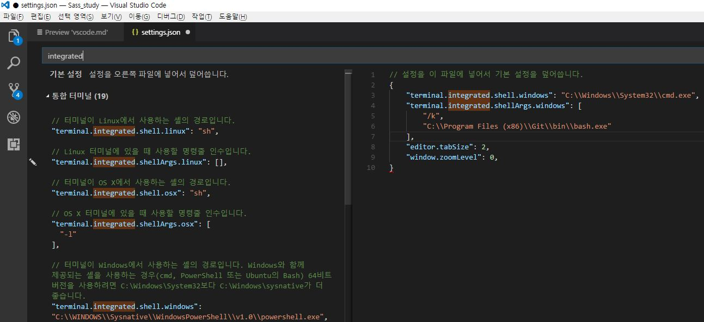
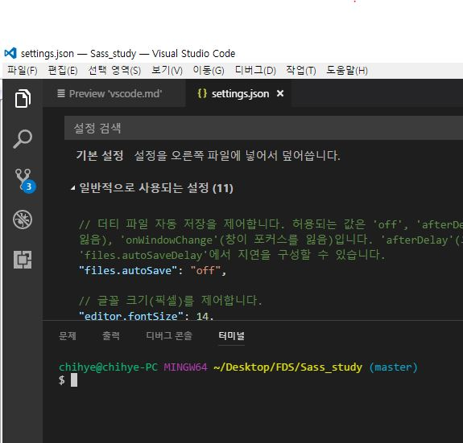
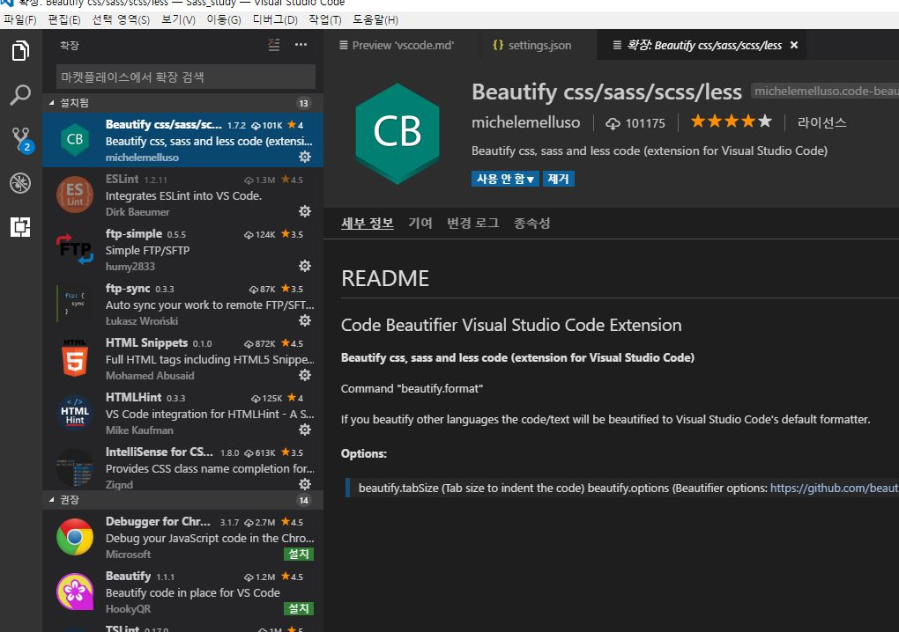
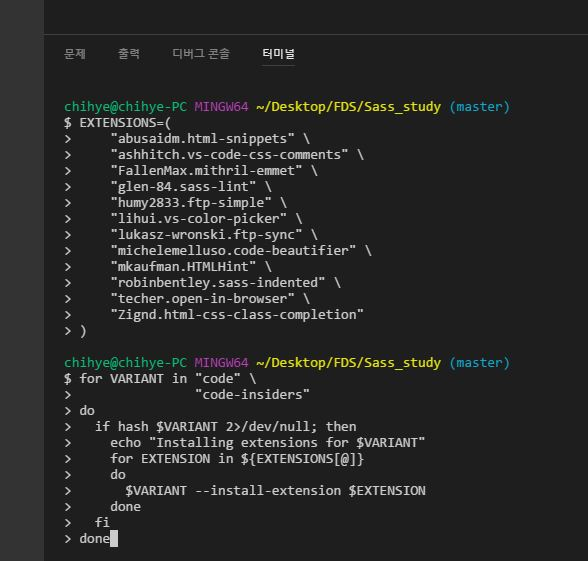

## vscode setting

[vscode download](https://code.visualstudio.com/)

## Creating User and Workspace Settings

https://code.visualstudio.com/docs/getstarted/settings

### setting.json 여는 방법

아래 방법 중 하나

+ File(파일) > Preferences(기본설정) > Settings(설정) (※ Mac의 경우 : Code > Preferences > Settings)
+ Command Palette(`Ctrl`+`Shift`+`P`)를 열어 __Open User Settings__ 과 __Open Workspace Settings__ 를 검색한다. 
+ (`Ctrl`+`,`)

```json
// 설정을 이 파일에 넣어서 기본 설정을 덮어씁니다.
{
    "editor.tabSize": 2,
    "window.zoomLevel": 0,
}
```



### 설정파일 위치
+ __Windows__ %APPDATA%\Code\User\settings.json
+ __Mac__ $HOME/Library/Application Support/Code/User/settings.json
+ __Linux__ $HOME/.config/Code/User/settings.json

## Integrated Terminal

https://code.visualstudio.com/docs/editor/integrated-terminal#_windows

Windows 10에서는 PowerShell, 이전 버전에서는 Windows 용 cmd.exe가 기본값으로 사용된다.  
이러한 설정은 `terminal.integrated.shell. *`을 설정하여 수동으로 재정의 할 수 있다. 

사용할 쉘 경로를 지정한 json구문을 `setting.json`에 추가한다.

### ※ Windows

```json
// Git Bash
"terminal.integrated.shell.windows": "C:\\Program Files\\Git\\bin\\bash.exe"
```
단축키 : `Ctrl`+ `

※ 위와 같이 설정했는데 안될 경우 [참고](https://stackoverflow.com/questions/40487445/how-to-change-the-integrated-terminal-in-visual-studio-code-or-vscode)
```json
"terminal.integrated.shell.windows": "C:\\Windows\\System32\\cmd.exe",
"terminal.integrated.shellArgs.windows": [
    "/k",
    "C:\\Program Files (x86)\\Git\\bin\\bash.exe"
]
```



## Install extensions

https://code.visualstudio.com/docs/editor/extension-gallery

`Ctrl+Shift+X` 클릭하여 열리는 사이드 바에서 검색 후 설치하거나 



아래 명령문에 커멘트 창에 넣으면 해당 `EXTENSIONS` 리스트 안의 목록들이 한꺼번에 설치된다.

```sh
EXTENSIONS=(
    "abusaidm.html-snippets" \
    "ashhitch.vs-code-css-comments" \
    "FallenMax.mithril-emmet" \
    "glen-84.sass-lint" \
    "humy2833.ftp-simple" \
    "lihui.vs-color-picker" \
    "lukasz-wronski.ftp-sync" \
    "michelemelluso.code-beautifier" \
    "mkaufman.HTMLHint" \
    "robinbentley.sass-indented" \
    "techer.open-in-browser" \
    "Zignd.html-css-class-completion"
)
for VARIANT in "code" \
               "code-insiders"
do
  if hash $VARIANT 2>/dev/null; then
    echo "Installing extensions for $VARIANT"
    for EXTENSION in ${EXTENSIONS[@]}
    do
      $VARIANT --install-extension $EXTENSION
    done
  fi
done
```



***
[참고 : Visual Studio Code 환경 설정 및 사용 방법 정리](http://bimmermac.com/1242)